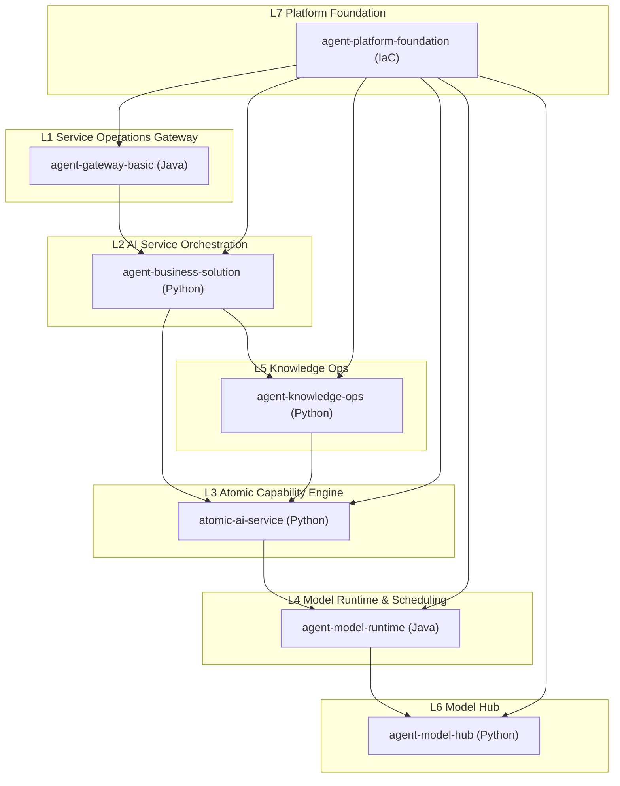
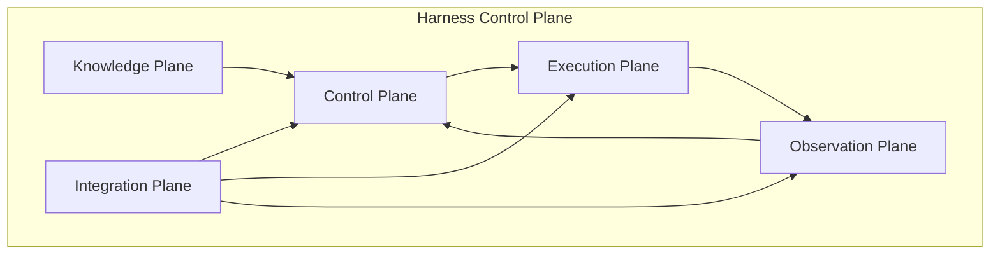

# ARCHITECTURE

## Bird’s-eye View (Seven Layers)

## Harness Control Plane

## Responsibilities by Plane
- Knowledge Plane: AGENTS.md, docs/, architecture map, specs
- Control Plane: planning, approvals, audit, policy
- Execution Plane: build/test/run, boot sequences
- Observation Plane: logs/metrics/traces, quality gates
- Integration Plane: project registry, contracts, adapters

## Interfaces (Planned)
- REST API for control plane operations
- CLI for local development and CI workflows
- Optional web UI for approvals and visualization

## Layer Integration Contracts
Each layer exposes a minimal harness contract:
- build: command and required env
- test: command and coverage/report output
- run: entrypoint, ports, health checks
- deploy: target environment and rollback

