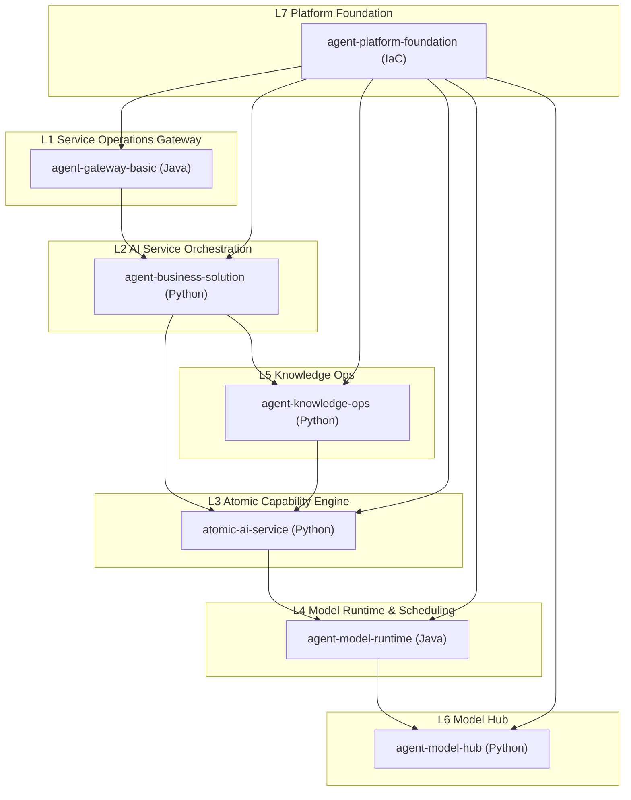
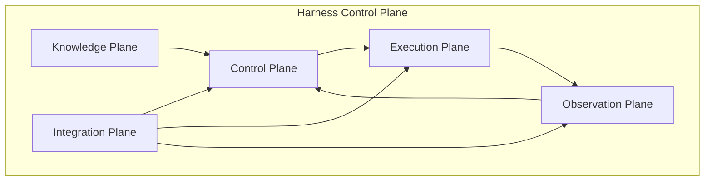
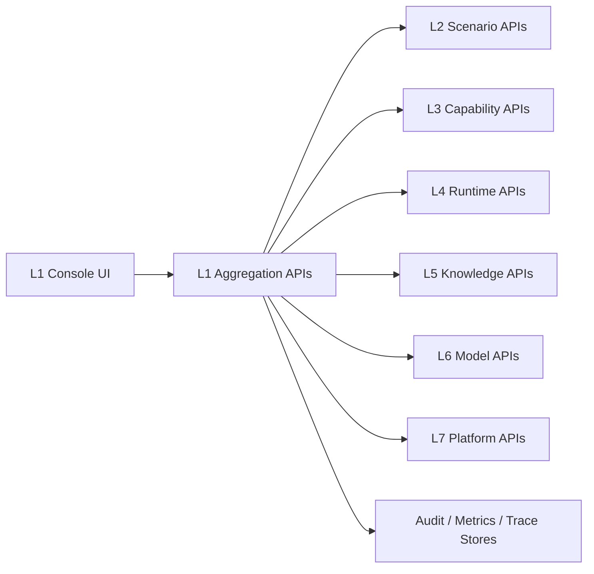

# ARCHITECTURE

## Bird’s-eye View (Seven Layers)

## Harness Control Plane

## Responsibilities by Plane
- Knowledge Plane: AGENTS.md, docs/, architecture map, specs
- Control Plane: planning, approvals, audit, policy
- Execution Plane: build/test/run, boot sequences
- Observation Plane: logs/metrics/traces, quality gates
- Integration Plane: project registry, contracts, adapters

## Interfaces (Planned)
- REST API for control plane operations
- CLI for local development and CI workflows
- Optional web UI for approvals and visualization

## L1 Console Architecture
L1 is the web entrypoint for both operations and debugging across L2-L7.

### Console Areas
- `Dashboard`: global status, health, alerts, traffic, quality
- `Operations`: routing, auth, quota, audit, approvals
- `Debug Studio`: request builder, contract mapping, trace, replay
- `Scenarios`: L2 scenario operations
- `Capabilities`: L3 capability operations
- `Model Runtime`: L4 queue, retry, breaker, routing, cost
- `Knowledge Ops`: L5 pipelines and asset status
- `Model Hub`: L6 model registry and evaluation status
- `Platform`: L7 infrastructure status
- `Quality & Reliability`: score, SLO, release risk, tech debt

### Aggregation APIs
- `GET /ops/overview`
- `GET /ops/layers`
- `GET /ops/l2/scenarios`
- `GET /ops/l3/capabilities`
- `GET /ops/l4/runtime`
- `GET /ops/l5/knowledge`
- `GET /ops/l6/models`
- `GET /ops/l7/platform`
- `POST /debug/request`
- `GET /debug/trace/{request_id}`
- `POST /debug/replay/{request_id}`

### Data Flow

## Layer Integration Contracts
Each layer exposes a minimal harness contract:
- build: command and required env
- test: command and coverage/report output
- run: entrypoint, ports, health checks
- deploy: target environment and rollback
