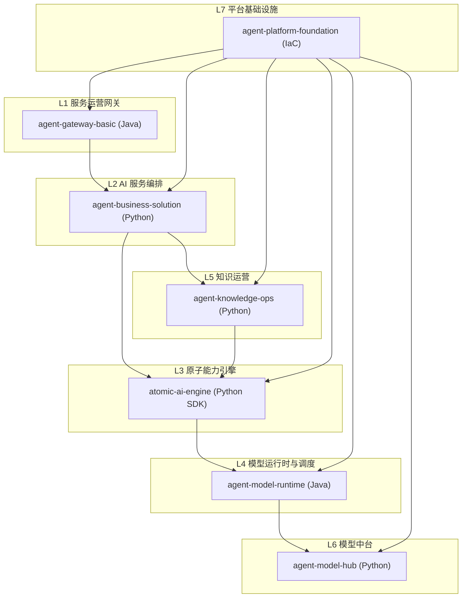
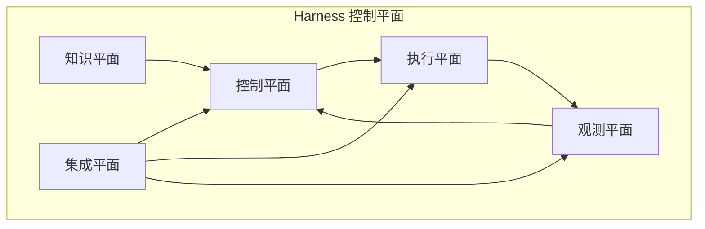

# 架构

## 鸟瞰图（七层）

## Harness 控制平面

## 各平面职责
- 知识平面：AGENTS.md、docs/、架构图、规格
- 控制平面：规划、审批、审计、策略
- 执行平面：构建/测试/运行、启动序列
- 观测平面：日志/指标/追踪、质量门禁
- 集成平面：项目注册、契约、适配

## 计划接口
- REST API：控制平面操作
- CLI：本地与 CI 工作流
- 可选 Web UI：审批与可视化

## 层级集成契约
每一层暴露最小 harness 契约：
- build：命令与依赖环境
- test：命令与报告输出
- run：入口、端口、健康检查
- deploy：目标环境与回滚策略

