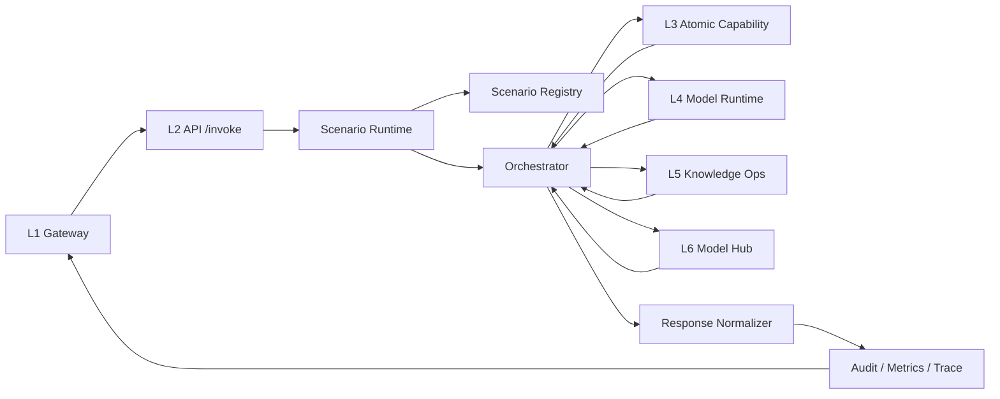

# agent-business-solution 方案

本文档定义 L2 `agent-business-solution` 的系统设计草案，作为场景解决方案层 / 智能体编排层的正式方案。

## 1. 目标
- L2 负责把底层能力组织成可交付的业务场景服务。
- 对上承接 L1 `agent-gateway-basic`。
- 对下编排 L3 `atomic-ai-engine`、L4 `agent-model-runtime`、L5 `agent-knowledge-ops`、L6 `agent-model-hub`。
- 对内提供统一的场景注册、执行、观测、版本治理能力。

## 2. 设计原则
- 场景优先，不做底层能力研发。
- 编排和能力解耦。
- 请求与响应标准化。
- 场景可版本化、可回放、可审计。
- 同时支持程序化编排和可视化编排。

## 3. 系统边界
L2 负责：
- 场景注册
- 场景运行
- 结果封装
- 场景观测
- 场景版本治理

L2 不负责：
- 模型调度与并发治理（L4）
- 原子能力实现（L3）
- 知识资产全生命周期治理（L5）
- 模型池治理（L6）
- 基础设施治理（L7）

## 4. 核心职责
- 面向业务场景提供可直接消费的服务。
- 编排 L3 原子能力、L4 模型运行时、L5 知识、L6 模型供给。
- 把复杂能力包装成稳定的“场景方案包”。
- 对上输出结构化、标准化的业务结果。

## 5. 目标场景与当前落地范围
### 5.1 目标支持的独立智能体场景
- 智能问答
- 专项整治
- 质疑投诉
- 辅助评审
- 合同审查
- 合规审查
- 价格预警
- 寻源
- 政策咨询
- 需求编写
- 辅助操作
- 围串标分析

### 5.2 当前已落地场景
- `intelligent_qa`：已落地，可执行
- `contract_review`：已落地，可执行
- `compliance_review`：已落地，可执行
- `procurement_file_review`：已落地，可执行，作为 L2 直连 L3 SDK 的采购文件样例场景

### 5.3 当前结论
- L2 的设计目标是承载多个独立业务智能体。
- 当前实现已从单场景 MVP 升级为多场景注册、分发与模块化骨架。
- 但距离覆盖全部目标场景仍有明显差距，后续需要继续按场景逐个落地。

## 6. 核心模块
1. `api`
- 对外 HTTP 接口
- 接收来自 L1 的统一调用

2. `scenario_registry`
- 管理场景元数据
- 场景版本、状态、入口、依赖

3. `scenario_runtime`
- 统一执行入口
- 根据 `scenario_code` 选择场景并运行

4. `orchestrators`
- `langgraph/`
- `visual_flow/`
- 屏蔽不同编排实现差异

5. `adapters`
- 对接 L3/L4/L5/L6

6. `schemas`
- 请求、响应、证据、错误、执行状态

7. `observability`
- trace、metrics、audit、execution log

8. `tests`
- 场景契约测试
- 场景回归测试
- adapter 测试

## 6.1 当前实现判断
- 当前代码不再只支持单一 `intelligent_qa`。
- 当前代码已支持按 `scenario_code` 注册、发现、分发多个场景。
- 当前代码已把场景执行逻辑拆到独立模块，便于后续继续新增智能体。
- 当前已具备把“典型场景”逐步实现为独立智能体的基础结构。

## 7. 建议目录结构
```text
agent-business-solution/
├── app.py
├── requirements.txt
├── README.md
├── config/
│   ├── scenarios.yaml
│   └── runtime.yaml
├── api/
│   ├── routes.py
│   └── handlers.py
├── scenario_registry/
│   ├── registry.py
│   └── models.py
├── scenario_runtime/
│   ├── runtime.py
│   ├── dispatcher.py
│   └── executor.py
├── orchestrators/
│   ├── base.py
│   ├── langgraph/
│   │   └── qa_graph.py
│   └── visual_flow/
│       └── loader.py
├── scenarios/
│   ├── intelligent_qa/
│   │   ├── manifest.yaml
│   │   └── service.py
│   └── contract_review/
│       ├── manifest.yaml
│       └── service.py
├── adapters/
│   ├── l3_atomic_ai_service.py
│   ├── l4_model_runtime.py
│   ├── l5_knowledge_ops.py
│   └── l6_model_hub.py
├── schemas/
│   ├── request.py
│   ├── response.py
│   ├── evidence.py
│   └── error.py
├── observability/
│   ├── metrics.py
│   ├── audit.py
│   └── tracing.py
├── scripts/
│   ├── build.sh
│   ├── test.sh
│   ├── run.sh
│   └── healthcheck.sh
└── tests/
    ├── test_health.py
    ├── test_invoke.py
    └── test_scenarios.py
```

## 8. 核心对象
### 8.1 ScenarioManifest
- `scenario_code`
- `name`
- `version`
- `status`
- `orchestrator_type`
- `entrypoint`
- `dependencies`
- `input_schema`
- `output_schema`

### 8.2 ScenarioRequest
- `request_id`
- `scenario_code`
- `tenant_id`
- `operator_id`
- `input`
- `context`
- `options`

### 8.3 ScenarioResponse
- `request_id`
- `scenario_code`
- `status`
- `result`
- `evidence`
- `metrics`
- `errors`

### 8.4 ExecutionRecord
- `request_id`
- `scenario_code`
- `started_at`
- `ended_at`
- `dependency_calls`
- `final_status`

## 9. 统一接口
### 9.1 健康检查
```http
GET /health
```

### 9.2 场景执行
```http
POST /invoke
```

请求示例：
```json
{
  "request_id": "req-001",
  "scenario_code": "intelligent_qa",
  "tenant_id": "demo",
  "operator_id": "user-1",
  "input": {
    "question": "采购评审里废标条款怎么判断？"
  },
  "context": {
    "channel": "gateway"
  },
  "options": {
    "debug": false
  }
}
```

响应示例：
```json
{
  "request_id": "req-001",
  "scenario_code": "intelligent_qa",
  "status": "success",
  "result": {
    "answer": "..."
  },
  "evidence": [
    {
      "type": "knowledge",
      "source": "policy_doc_12",
      "snippet": "..."
    }
  ],
  "metrics": {
    "duration_ms": 842
  },
  "errors": []
}
```

### 9.3 场景列表
```http
GET /scenarios
```

### 9.4 场景详情
```http
GET /scenarios/{scenario_code}
```

### 9.5 执行记录查询
```http
GET /executions/{request_id}
```

## 10. 执行流


## 11. 场景注册机制
- 每个场景一个 `manifest.yaml`
- 启动时加载全部 manifest
- 场景状态建议：
- `draft`
- `testing`
- `active`
- `deprecated`

## 12. 编排抽象
- 定义统一接口 `Orchestrator.execute(request)`
- `langgraph` 和 `visual_flow` 都实现该接口
- `scenario_runtime` 不关心底层编排方式

## 13. 依赖适配原则
- L2 不直接写复杂底层逻辑
- 通过 adapter / SDK client 调用 L3/L4/L5/L6
- adapter 负责超时、重试、错误映射、响应标准化

## 14. 可观测性
每次执行至少记录：
- `request_id`
- `scenario_code`
- `status`
- `duration_ms`
- `dependency_calls`
- `error_type`

第一版先实现执行日志，后续再扩展总览与聚合指标。

## 15. MVP 建议
- 先只做一个场景：`intelligent_qa`
- 先只支持一种编排：程序化编排
- 先只接两个下游：
- L3 能力 SDK
- L4 模型运行时

## 15.1 当前直连 L3 SDK 的样例场景
- `procurement_file_review` 已作为当前第一个 L2 直接调用 L3 SDK 的场景。
- 当前编排链路为：`file_parse -> rule_engine -> evidence_chain_locate -> structured_extraction -> L4 fallback`。
- 其中规则命中时不进入模型兜底，规则未命中时才通过 `structured_extraction` 间接调用 L4。

## 16. 第一阶段验收标准
- `/health` 可用
- `/invoke` 可执行 `intelligent_qa`
- 场景注册表可返回场景信息
- 至少有 1 条真实编排链路
- 有基本执行日志和错误返回

## 17. MVP 范围定义
### 17.1 In Scope
- 场景注册中心支持静态加载 `intelligent_qa`
- 统一入口 `POST /invoke`
- 程序化编排执行器
- L3 与 L4 两个下游 adapter
- 执行日志、错误返回、基础耗时指标
- `GET /scenarios` 与 `GET /scenarios/{scenario_code}`

### 17.2 Out Of Scope
- 可视化编排设计器
- 多租户配置后台
- 场景灰度发布
- 场景版本回滚 UI
- L5/L6 深度集成
- 长会话记忆与人工审批工作流

## 18. MVP 目录骨架
```text
agent-business-solution/
├── app.py
├── config/
│   └── scenarios.yaml
├── scenario_registry/
│   ├── models.py
│   └── registry.py
├── scenario_runtime/
│   ├── runtime.py
│   └── executor.py
├── scenarios/
│   └── intelligent_qa/
│       ├── manifest.yaml
│       └── service.py
├── orchestrators/
│   ├── base.py
│   └── langgraph/
│       └── intelligent_qa_graph.py
├── adapters/
│   ├── l3_atomic_ai_service.py
│   └── l4_model_runtime.py
├── observability/
│   ├── audit.py
│   └── metrics.py
├── scripts/
│   ├── build.sh
│   ├── test.sh
│   ├── run.sh
│   └── healthcheck.sh
└── tests/
    ├── test_health.py
    ├── test_registry.py
    └── test_intelligent_qa.py
```

## 19. 首个场景：intelligent_qa
### 19.1 场景目标
- 面向业务用户提供带证据摘要的智能问答服务。
- 先完成“问题输入 -> 能力调用 -> 结果归一化 -> 结构化输出”的最小闭环。

### 19.2 编排步骤
1. 校验请求并装配执行上下文
2. 调用 L3 做问题理解、召回或证据预处理
3. 调用 L4 做答案生成或摘要生成
4. 组装 answer、evidence、metrics
5. 记录 execution log 并返回结果

### 19.3 成功标准
- 同一请求可稳定返回结构化响应
- 响应中至少包含 `answer`、`evidence`、`duration_ms`
- 下游失败时返回标准错误结构，而不是裸异常

## 20. intelligent_qa 接口契约
### 20.1 调用入口
```http
POST /invoke
Content-Type: application/json
```

### 20.2 请求体
```json
{
  "request_id": "req-qa-001",
  "scenario_code": "intelligent_qa",
  "tenant_id": "demo",
  "operator_id": "user-1",
  "input": {
    "question": "采购评审里废标条款怎么判断？"
  },
  "context": {
    "channel": "gateway",
    "source_system": "agent-gateway-basic"
  },
  "options": {
    "debug": false
  }
}
```

### 20.3 成功响应
```json
{
  "request_id": "req-qa-001",
  "scenario_code": "intelligent_qa",
  "status": "success",
  "result": {
    "answer": "根据当前规则，需先核验招标文件中的废标条款、资格要求和响应偏差。",
    "summary": "先做条款识别，再结合规则判断是否触发废标条件。"
  },
  "evidence": [
    {
      "type": "capability_output",
      "source": "atomic-ai-engine",
      "snippet": "已识别到资格性条款与偏差项。"
    }
  ],
  "metrics": {
    "duration_ms": 820
  },
  "errors": []
}
```

### 20.4 失败响应
```json
{
  "request_id": "req-qa-001",
  "scenario_code": "intelligent_qa",
  "status": "error",
  "result": {},
  "evidence": [],
  "metrics": {
    "duration_ms": 120
  },
  "errors": [
    {
      "code": "UPSTREAM_TIMEOUT",
      "message": "atomic-ai-engine request timed out"
    }
  ]
}
```

## 21. 与 L1/L3/L4 的交互约束
### 21.1 L1 -> L2
- L1 通过统一网关把业务请求转发到 L2 `POST /invoke`
- L1 负责鉴权、配额、审计与统一入口
- L2 负责场景识别、编排执行与结果封装

### 21.2 L2 -> L3
- L2 通过 L3 SDK 获取原子能力结果
- L3 返回结构化能力输出，L2 不直接在内部重写能力逻辑

### 21.3 L2 -> L4
- L2 调用 L4 获取模型执行结果
- L4 负责并发、重试、稳定性治理
- L2 只关心业务编排语义和错误映射
