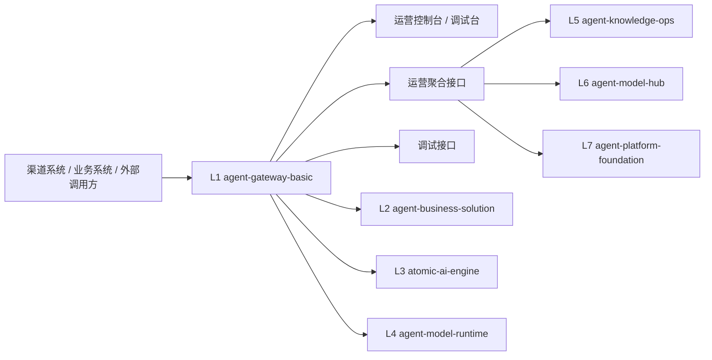
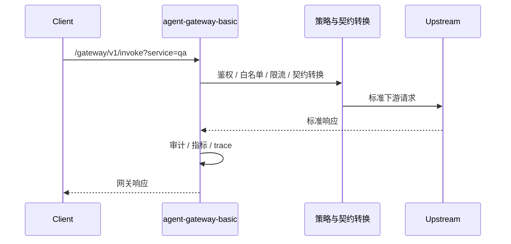
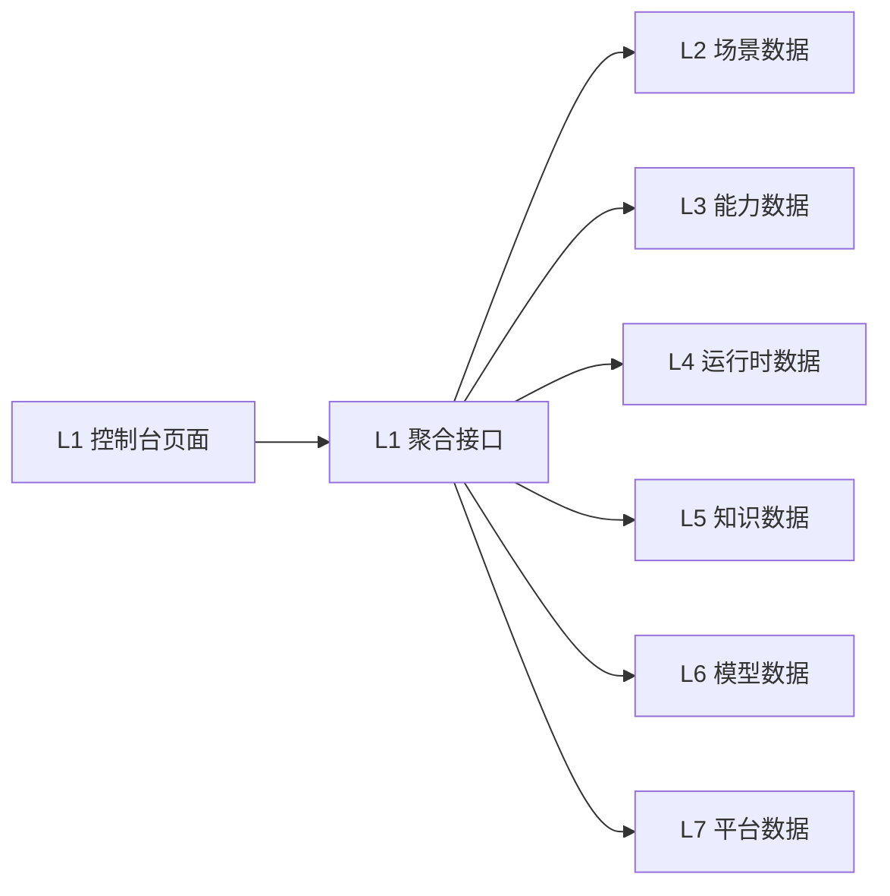

# agent-gateway-basic 整体方案（技术评审版）

## 1. 文档目标
本文档用于技术评审，说明 L1 `agent-gateway-basic` 的定位、职责边界、总体架构、核心能力、接口设计、数据流、非功能要求、当前落地情况与后续演进方向。

## 2. 项目定位
- 项目名：`agent-gateway-basic`
- 层级：L1 服务运营网关层
- 技术：Java
- 角色：
  - 七层体系统一入口
  - 统一运营控制平面入口
  - 统一调试与观测入口
- 服务对象：
  - 渠道系统
  - 业务系统
  - 外部调用方
  - 生态伙伴

## 3. 职责边界
### 3.1 核心职责
- 统一路由：承接所有外部入口请求并分发到 L2-L4 目标服务。
- 统一鉴权：基于 API Key 与客户端策略控制访问。
- 统一策略执行：校验客户端可访问服务范围与限流规则。
- 统一审计：记录请求决策、目标服务、调用结果与操作人信息。
- 统一运营：对外提供聚合后的指标、配置、上游健康、错误码与契约转换视图。
- 统一调试：提供请求构造、契约转换可视化、trace、replay 能力。
- 统一控制台：为 L2-L7 提供运营页面与调试页面。

### 3.2 不承担的职责
- 不承载业务场景编排逻辑：由 L2 `agent-business-solution` 负责。
- 不承载原子能力研发：由 L3 `atomic-ai-engine` 负责。
- 不承载模型并发治理细节：由 L4 `agent-model-runtime` 负责。
- 不承载知识资产生命周期治理：由 L5 `agent-knowledge-ops` 负责。
- 不承载模型池治理：由 L6 `agent-model-hub` 负责。
- 不承载基础设施与平台工程实现：由 L7 `agent-platform-foundation` 负责。

## 4. 价值说明
- 对外：把 AI 服务变成可接入、可运营、可监管的标准入口。
- 对内：把七层体系的运行状态、契约映射、错误分布、调试链路收敛到一个控制平面。
- 对交付：为实施与运维提供稳定的入口、定位和回放能力。
- 对治理：把鉴权、配额、审计、熔断、聚合观测统一到 L1 实施。

## 5. 总体架构

## 6. 逻辑模块设计
### 6.1 接入层
- HTTP Server
- 网关调用入口：`/gateway/v1/invoke`
- 静态控制台入口：`/console/*`

### 6.2 策略层
- API Key 鉴权
- 客户端服务白名单
- 按客户端限流
- 按客户端 + 服务限流
- 访问拒绝与错误码记录

### 6.3 路由与契约转换层
- 根据 `service` 选择下游目标
- 根据目标层做标准契约转换：
  - `qa` -> L2 `intelligent_qa`
  - `compliance` -> L3 `structured_extraction`
  - `pricing` -> L4 `pricing_inference`
- 统一封装下游调用响应

### 6.4 上游治理层
- Upstream 健康探测
- 失败计数
- 短时熔断
- 配置热重载

### 6.5 观测与审计层
- 审计日志持久化
- 指标持久化
- 历史指标查询
- 契约转换统计
- 契约错误码统计

### 6.6 控制台聚合层
- 七层总览接口
- 分层聚合接口
- 调试接口
- trace / replay
- 控制台前端页面

## 7. 当前能力清单
### 7.1 网关基础能力
- API Key 鉴权
- 服务路由
- 客户端访问策略
- 按分钟限流
- 按客户端 + 服务粒度配额控制
- 请求审计
- 上游转发

### 7.2 稳定性治理能力
- 上游健康检查
- 连续失败计数
- 熔断保护
- 配置热重载

### 7.3 运营能力
- `/ops/config`
- `/ops/upstreams`
- `/ops/metrics/overview`
- `/ops/metrics/history`
- `/ops/audits`
- `/ops/overview`
- 契约转换统计
- 按契约类型的错误码统计

### 7.4 七层聚合能力
- `/ops/layers`
- `/ops/l2/scenarios`
- `/ops/l3/capabilities`
- `/ops/l4/runtime`
- `/ops/l5/knowledge`
- `/ops/l6/models`
- `/ops/l7/platform`

### 7.5 调试能力
- `POST /debug/request`
- `GET /debug/trace/{request_id}`
- `POST /debug/replay/{request_id}`

### 7.6 控制台能力
- Dashboard
- L1 网关页
- L2 场景页
- L3 能力页
- L4 运行时页
- L5 知识页
- L6 模型页
- L7 平台页
- 调试台
- 七层状态矩阵
- 搜索 / 筛选
- URL 状态同步
- 详情抽屉
- 红黄绿告警态展示

## 8. 关键接口设计
### 8.1 网关调用入口
- `GET|POST /gateway/v1/invoke?service=<qa|compliance|pricing>`

请求头：
- `x-api-key`
- `x-tenant-id`
- `x-operator-id`

### 8.2 契约映射
#### `service=qa`
- 目标：L2 `agent-business-solution`
- 目标契约：`L2.intelligent_qa`
- 映射规则：
  - `prompt -> input.question`
  - `x-tenant-id -> tenant_id`
  - `x-operator-id -> operator_id`
  - `scenario_code = intelligent_qa`

#### `service=compliance`
- 目标：L3 `atomic-ai-engine`
- 目标契约：`L3.structured_extraction`
- 映射规则：
  - `document` 或 `prompt -> input.document`
  - `capability_code = structured_extraction`

#### `service=pricing`
- 目标：L4 `agent-model-runtime`
- 目标契约：`L4.pricing_inference`
- 上游目标入口：`POST /runtime/invoke`
- 映射规则：
  - `payload` 或 `prompt -> input.payload`
  - `task_type = pricing_inference`

### 8.3 运营接口
- `GET /ops/metrics/overview`
- `GET /ops/metrics/history`
- `GET /ops/audits`
- `GET /ops/config`
- `GET /ops/upstreams`
- `GET /ops/overview`
- `GET /ops/layers`
- `GET /ops/l2/scenarios`
- `GET /ops/l3/capabilities`
- `GET /ops/l4/runtime`
- `GET /ops/l5/knowledge`
- `GET /ops/l6/models`
- `GET /ops/l7/platform`
- `POST /ops/reload`

### 8.4 调试接口
- `POST /debug/request?service=<qa|compliance|pricing>`
- `GET /debug/trace/{request_id}`
- `POST /debug/replay/{request_id}`

## 9. 配置与数据文件
### 9.1 配置文件
- `config/routes.properties`
- `config/clients.properties`

### 9.2 运行数据文件
- `data/audits.log`
- `data/metrics.log`

### 9.3 配置项说明
客户端配额：
- `client.<name>.requests_per_minute=<default_quota>`
- `client.<name>.service.<service>.requests_per_minute=<service_quota_override>`

上游健康检查：
- `service.<name>.health_url=<upstream_health_endpoint>`

## 10. 核心流程
### 10.1 请求处理主流程

### 10.2 运营聚合流程

## 11. 非功能要求
### 11.1 安全
- 所有请求必须携带 `x-api-key`
- 按客户端白名单控制可访问服务
- 记录租户与操作人信息
- 审计记录可追溯

### 11.2 可靠性
- 对上游提供健康探测
- 连续失败后熔断
- 配置可热重载，减少重启窗口

### 11.3 可观测性
- 审计日志落盘
- 指标日志落盘
- 提供总览与历史视图
- 控制台可查看分层状态与错误分布

### 11.4 可演进性
- 新服务可通过配置新增路由
- 新下游契约可通过映射逻辑扩展
- 控制台页面可按层继续扩展

## 12. 测试与验证方式
构建与验证入口：
- `/Users/linzeran/code/2026-zn/harnees_aimp/agent-gateway-basic/scripts/build.sh`
- `/Users/linzeran/code/2026-zn/harnees_aimp/agent-gateway-basic/scripts/test.sh`
- `/Users/linzeran/code/2026-zn/harnees_aimp/agent-gateway-basic/scripts/run.sh`
- `/Users/linzeran/code/2026-zn/harnees_aimp/agent-gateway-basic/scripts/healthcheck.sh`

当前自测覆盖：
- 鉴权失败
- 服务策略拒绝
- 默认配额与服务级配额
- `qa/compliance/pricing` 契约映射
- 运营接口基础返回
- 调试接口基础返回
- reload 基础成功路径

## 13. 当前落地范围与评审结论
### 13.1 已落地
- L1 作为真实网关雏形已跑通
- L1 已与 L2/L3/L4 完成最小契约打通
- L1 已提供覆盖 L2-L7 的控制台聚合入口
- L1 已具备可用于演示和验证的调试、trace、replay 能力

### 13.2 当前限制
- 审计和指标仍是本地文件级持久化，未进入正式观测平台
- 熔断与告警仍是轻量实现，未接统一告警中心
- 控制台仍以最小聚合视图为主，缺少更深层明细与权限体系
- L5-L7 的聚合数据仍以最小摘要为主

### 13.3 评审建议
- 认可 L1 作为七层统一入口与控制平面的架构方向
- 进入下一阶段时，优先补齐：
  - 统一身份与权限模型
  - 告警中心与历史查询模型
  - 更细粒度的上游治理策略
  - 生产级日志、指标、trace 接入

## 14. 后续演进路线
### 第一阶段：入口可用
- 网关入口
- 鉴权与限流
- 契约映射
- 控制台基础页

### 第二阶段：运营可管
- 更完整的运营总览
- 配置热重载
- 审计与指标持久化
- 聚合 L2-L7 状态

### 第三阶段：调试可追
- trace / replay
- 契约转换可视化
- 页面级筛选与详情抽屉

### 第四阶段：生产可控
- 统一权限
- 正式告警与观测平台
- 正式存储与查询模型
- 更强的发布、回滚和故障演练体系
