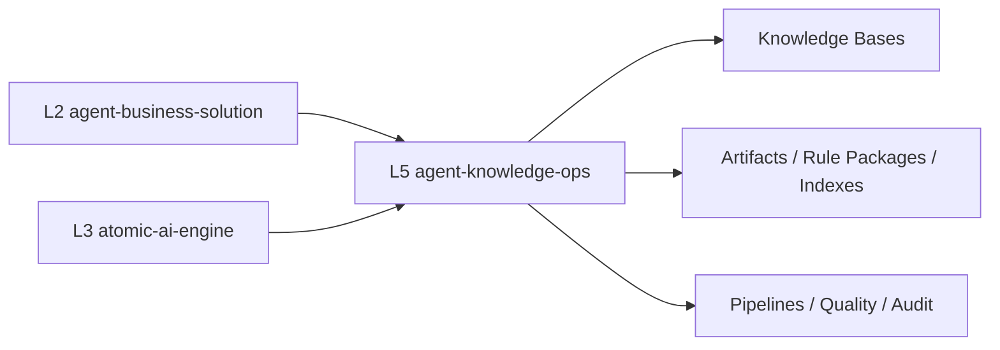
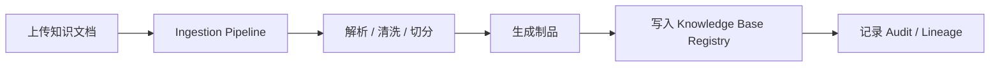
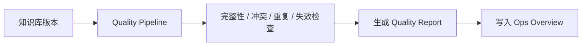

# agent-knowledge-ops 方案

本文档定义 L5 `agent-knowledge-ops` 的技术方案，作为知识运营层 / 知识资产治理层的正式设计文档，用于技术评审与后续开发落地。

## 1. 定位
- 项目名：`agent-knowledge-ops`
- 层级：L5
- 技术：Python
- 角色：知识资产治理与运营层

一句话定义：
- `agent-knowledge-ops` 是知识资产的治理与运营中心，不是单纯的知识检索服务。

## 2. 设计目标
- 为 L2 `agent-business-solution` 与 L3 `atomic-ai-engine` 提供统一治理后的知识资产。
- 统一管理知识库、导入流水线、质量流水线、审计链路、制品和授权范围。
- 保障知识资产可用、可信、可追溯、可授权、可持续迭代。
- 为 L1 控制台提供可聚合的知识运营视图。

治理目标：
- 可用：知识资产可稳定被 L2/L3 消费
- 可信：质量可评估、问题可发现
- 可追溯：来源、版本、流水线、使用链路可追踪
- 可授权：租户、角色、范围清晰
- 可持续迭代：更新有版本、有审计、有回滚依据

## 3. 职责边界
### 3.1 L5 负责
- 知识库管理
- 数据治理流水线
- 监控审计流水线
- 质量管理流水线
- 制品管理
- 配置管理
- 安全与授权管理
- 知识资产运营总览

### 3.2 L5 不负责
- 业务场景编排：L2
- 原子能力实现：L3
- 模型执行治理：L4
- 模型资产治理：L6
- 统一接入和网关运营入口：L1

## 4. 上下游关系


关系说明：
- L2 消费场景绑定的知识资产、知识版本和授权范围。
- L3 消费索引、规则包、条款库、知识图谱等治理后的制品。
- L5 统一管理知识来源、导入处理、质量评分、制品发布和审计链路。

## 5. 核心模块设计
### 5.1 Knowledge Base Registry
负责知识库注册和元信息管理。

能力包括：
- 知识库创建、查看、上下线
- 业务域、租户、所有者、版本管理
- 状态管理（draft / syncing / ready / deprecated）

### 5.2 Ingestion Pipeline
负责知识导入和治理流水线。

能力包括：
- 文件导入
- 解析、切分、清洗、结构化
- 标签抽取
- 制品生成
- 入库与版本登记

### 5.3 Quality Pipeline
负责知识质量管理。

能力包括：
- 完整性检查
- 冲突检查
- 重复检查
- 失效检查
- 引用有效性检查
- 质量评分与问题报告

### 5.4 Artifact Manager
负责知识制品管理。

制品包括：
- 原始文档
- chunk / 切片结果
- 索引制品
- 向量制品
- 规则包
- 抽取结果
- 图谱制品

### 5.5 Audit & Lineage
负责审计与知识链路追踪。

能力包括：
- 谁导入了什么
- 谁变更了什么
- 哪次流水线生成了哪些制品
- 哪个场景或能力正在消费哪个知识版本

### 5.6 Security & Authorization
负责权限和数据范围治理。

能力包括：
- 租户隔离
- 角色授权
- 数据分级
- 配置可见性控制

### 5.7 Ops API
面向 L1 控制台和 L2/L3 的查询接口。

建议接口：
- `GET /knowledge-bases`
- `POST /knowledge-bases`
- `GET /pipelines/runs`
- `POST /pipelines/ingest`
- `POST /pipelines/quality-check`
- `GET /artifacts`
- `GET /quality/reports`
- `GET /audit/records`
- `GET /lineage/{knowledge_base_id}`
- `GET /ops/overview`

## 6. 核心数据模型
### KnowledgeBase
- `knowledge_base_id`
- `name`
- `domain`
- `tenant_id`
- `status`
- `version`
- `owner`

### KnowledgeDocument
- `document_id`
- `knowledge_base_id`
- `source_type`
- `title`
- `status`
- `version`

### PipelineRun
- `pipeline_run_id`
- `pipeline_type`
- `status`
- `started_at`
- `ended_at`
- `inputs`
- `outputs`

### Artifact
- `artifact_id`
- `artifact_type`
- `knowledge_base_id`
- `version`
- `storage_ref`

### QualityReport
- `knowledge_base_id`
- `version`
- `score`
- `issues`
- `generated_at`

### AuditRecord
- `actor`
- `action`
- `target_type`
- `target_id`
- `timestamp`

## 7. 关键接口契约
### 7.1 知识库管理
- `GET /knowledge-bases`
- `POST /knowledge-bases`
- `GET /knowledge-bases/{id}`
- `POST /knowledge-bases/{id}/publish`

### 7.2 流水线
- `POST /pipelines/ingest`
- `POST /pipelines/quality-check`
- `GET /pipelines/runs/{run_id}`

### 7.3 制品
- `GET /artifacts`
- `GET /artifacts/{id}`

### 7.4 质量
- `GET /quality/reports`
- `GET /quality/reports/{knowledge_base_id}`

### 7.5 审计与追溯
- `GET /audit/records`
- `GET /lineage/{knowledge_base_id}`

### 7.6 运营总览
- `GET /ops/overview`

## 8. 关键流程
### 8.1 知识导入流程


### 8.2 质量检查流程


## 9. 在整套系统中的作用
L5 的价值不在于“直接回答问题”，而在于保证知识作为企业资产能被稳定运营。

典型作用：
1. 为 L2 提供已授权的知识空间和知识版本。
2. 为 L3 提供规则包、条款库、索引、图谱等治理后的知识制品。
3. 为 L1 控制台提供知识库、流水线、质量、审计的运营视图。
4. 为问题追溯提供来源、版本和变更链路。

## 10. MVP 范围
### 10.1 第一阶段必须有
- 知识库注册表
- 导入流水线运行记录
- 质量报告
- 运营总览

### 10.2 第二阶段再做
- 制品明细管理
- 审计与血缘追踪
- 发布审批
- 授权模型
- 场景与能力的知识依赖绑定

## 11. 非功能要求
### 11.1 可追溯性
- 所有知识变更必须可审计。
- 流水线、版本、知识库之间关系必须可追踪。

### 11.2 一致性
- 知识库状态、流水线结果、质量报告口径一致。

### 11.3 安全性
- 支持租户隔离、角色授权、数据分级。

### 11.4 可运营性
- 通过 `/ops/overview` 输出稳定摘要。
- 供 L1 控制台统一展示。

## 12. 目录结构建议
```text
agent-knowledge-ops/
├── app.py
├── registry/
│   ├── knowledge_base.py
│   └── metadata_store.py
├── pipelines/
│   ├── ingest.py
│   ├── quality.py
│   └── runs.py
├── artifacts/
│   ├── manager.py
│   └── models.py
├── audit/
│   ├── records.py
│   └── lineage.py
├── security/
│   └── policy.py
├── ops/
│   └── overview.py
├── scripts/
│   ├── build.sh
│   ├── test.sh
│   ├── run.sh
│   └── healthcheck.sh
└── README.md
```

## 13. 当前实现与目标差距分析
基于 `/Users/linzeran/code/2026-zn/harnees_aimp/agent-knowledge-ops/app.py` 的当前实现，L5 现状更接近“控制台摘要桩”，还没有达到知识资产治理层目标。

### 13.1 当前已具备
- `GET /health`
- `GET /ops/knowledge`
- 最小知识库摘要
- 最小流水线摘要
- 最小质量摘要
- Python 单进程服务骨架
- 基础 `scripts/build.sh`、`scripts/run.sh`、`scripts/test.sh`

### 13.2 当前明显缺失
- 没有真正的知识库注册模型
- 没有知识文档对象和版本对象
- 没有导入流水线运行记录模型
- 没有质量报告模型
- 没有制品管理
- 没有审计记录和血缘追踪
- 没有授权和数据范围控制
- 没有供 L2/L3 统一消费的知识资产接口
- 运营接口仍是固定摘要，不能反映真实运行状态

### 13.3 当前实现的主要风险
- 知识库和流水线信息是固定返回，无法支撑真实运营。
- 缺少知识版本与制品后，L2/L3 无法稳定引用“哪一版知识资产”。
- 缺少质量和审计后，知识可信与可追溯目标无法成立。
- 如果后续直接往当前 `app.py` 上堆逻辑，结构会快速失控。

### 13.4 建议的落地顺序
1. 先补 `KnowledgeBase`、`PipelineRun`、`QualityReport` 三个核心模型。
2. 再补知识库注册接口和导入流水线记录接口。
3. 接着补质量报告和运营总览。
4. 再补制品、审计、血缘。
5. 最后扩展授权和发布治理。

### 13.5 当前评审结论
- L5 的层级定位是对的，职责边界清晰。
- 当前实现仍处于“最小摘要占位服务”阶段。
- 下一轮开发应优先把它升级为“知识库注册 + 导入记录 + 质量报告 + 总览”的治理 MVP。

## 14. 评审重点
技术评审时建议重点看：
1. L5 是否真正承担“知识资产治理”而不是“知识查询服务”。
2. L5 与 L2/L3 的边界是否稳定。
3. 知识库、流水线、质量、制品、审计是否有统一数据模型。
4. 运营接口是否足够支撑 L1 控制台。
5. 后续授权、血缘、发布治理是否容易扩展。

## 15. 结论
建议定稿方向：
- L5 采用独立 Python 服务。
- 先做知识治理 MVP。
- 由 L2/L3 统一消费治理后的知识资产。
- 由 L1 聚合 L5 运营视图。
- 后续再扩展制品、血缘、授权与发布治理。
