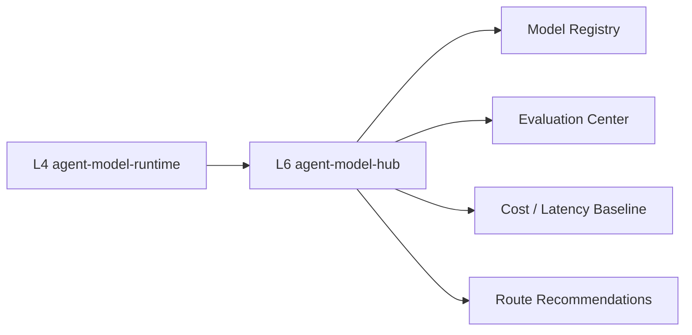
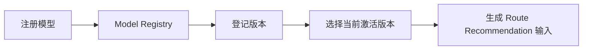
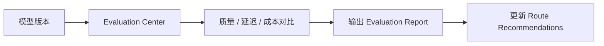

# agent-model-hub 方案

本文档定义 L6 `agent-model-hub` 的技术方案，作为模型供给与治理层的正式设计文档，用于技术评审与后续开发落地。

## 1. 定位
- 项目名：`agent-model-hub`
- 层级：L6
- 技术：Python
- 角色：模型供给与治理层

一句话定义：
- `agent-model-hub` 是模型资产的统一纳管与治理中心，不负责具体模型执行。

## 2. 设计目标
- 为 L4 `agent-model-runtime` 提供统一模型池、模型版本和路由决策输入。
- 统一管理通用大模型、行业垂直模型、多模态模型、向量模型、重排序模型、OCR 模型等模型资产。
- 建立稳定、可替换、可评估的模型能力池。
- 为 L1 控制台提供模型供给、评测和成本的统一运营视图。

治理目标：
- 稳定：模型资产有状态、有版本、有推荐版本
- 可替换：模型切换有登记、有兼容信息
- 可评估：效果、时延、成本可对比
- 可路由：为 L4 提供清晰的策略输入

## 3. 职责边界
### 3.1 L6 负责
- 模型注册与纳管
- 模型版本管理
- 模型评测对比
- 路由策略输入供给
- 效果与成本基线管理
- 模型供给运营总览

### 3.2 L6 不负责
- 模型执行与并发治理：L4
- 业务场景编排：L2
- 原子能力抽象：L3
- 知识资产治理：L5
- 统一入口与接入运营：L1

## 4. 上下游关系


关系说明：
- L4 不直接维护模型资产，而是消费 L6 提供的模型供给和路由依据。
- L6 不执行模型请求，只管理模型池、版本、评测、成本和推荐路由。
- L1 通过聚合接口查看模型池与评测情况。
- 当前实现中，L6 的路由建议已经扩展为可返回 `preferred_endpoint`、`preferred_auth_env`、`preferred_provider` 等远程模型元数据，供 L4 执行真实远程路由。

## 5. 核心模块设计
### 5.1 Model Registry
负责模型注册与元信息管理。

能力包括：
- 模型登记、查看、上下线
- 按类型管理模型（LLM / reranker / OCR / vector / multimodal）
- 记录 provider、status、能力标签

### 5.2 Version Manager
负责模型版本治理。

能力包括：
- 版本列表
- 当前激活版本
- 推荐版本
- 兼容性说明
- 发布状态管理

### 5.3 Evaluation Center
负责模型评测与横向对比。

能力包括：
- benchmark 结果记录
- 不同模型、不同版本的效果对比
- 质量、延迟、成本结果汇总

### 5.4 Routing Policy Input
负责给 L4 提供路由决策输入。

能力包括：
- 按 `task_type` 推荐主模型和备用模型
- 成本优先 / 延迟优先 / 效果优先模式
- 针对能力类型和任务类型输出建议

### 5.5 Cost & Effect Baseline
负责效果与成本基线。

能力包括：
- token 成本基线
- 平均延迟基线
- 成功率 / 稳定性基线
- benchmark 质量分基线

### 5.6 Ops API
面向 L1 控制台和 L4 的统一接口。

建议接口：
- `GET /models`
- `POST /models`
- `GET /models/{model_id}`
- `GET /models/{model_id}/versions`
- `POST /models/{model_id}/versions`
- `POST /models/{model_id}/activate`
- `GET /evaluations`
- `GET /evaluations/{model_id}`
- `GET /routes/recommendations`
- `GET /routes/recommendations/{task_type}`
- `GET /cost-baseline`
- `GET /ops/overview`

## 6. 核心数据模型
### ModelRecord
- `model_id`
- `name`
- `type`
- `provider`
- `status`
- `current_version`
- `capabilities`

### ModelVersion
- `model_id`
- `version`
- `status`
- `released_at`
- `compatibility`

### EvaluationReport
- `model_id`
- `version`
- `benchmark`
- `score`
- `latency_ms`
- `cost_per_1k_tokens`

### RouteRecommendation
- `task_type`
- `preferred_model`
- `fallback_model`
- `policy_mode`
- `preferred_endpoint`
- `preferred_auth_env`
- `preferred_provider`

### CostBaseline
- `model_id`
- `version`
- `currency`
- `input_cost`
- `output_cost`

## 7. 关键接口契约
### 7.1 模型注册
- `GET /models`
- `POST /models`
- `GET /models/{model_id}`

### 7.2 版本管理
- `GET /models/{model_id}/versions`
- `POST /models/{model_id}/versions`
- `POST /models/{model_id}/activate`

### 7.3 评测
- `GET /evaluations`
- `GET /evaluations/{model_id}`

### 7.4 路由建议
- `GET /routes/recommendations`
- `GET /routes/recommendations/{task_type}`

### 7.5 成本基线
- `GET /cost-baseline`

### 7.6 运营总览
- `GET /ops/overview`

## 8. 关键流程
### 8.1 模型注册与激活流程


### 8.2 评测与路由建议流程


## 9. 在整套系统中的作用
L6 的价值不在于直接执行模型，而在于让模型池成为可治理的企业级资产。

典型作用：
1. 为 L4 提供可选模型池与推荐路由。
2. 为模型切换提供版本依据和评测依据。
3. 为 L1 提供模型数量、评测结果、成本基线等运营视图。
4. 为架构决策提供“该任务用哪个模型更稳、更便宜、更好”的统一依据。

## 10. MVP 范围
### 10.1 第一阶段必须有
- 模型注册表
- 版本管理
- 评测报告
- 运营总览

### 10.2 第二阶段再做
- 路由建议接口
- 成本基线细化
- 模型兼容性管理
- 供应商故障与替换记录
- 与 L4 的动态路由联动

## 11. 非功能要求
### 11.1 一致性
- 模型、版本、评测和成本口径一致。

### 11.2 可替换性
- 激活版本与推荐模型可快速切换。

### 11.3 可评估性
- 至少提供 benchmark、时延、成本三类指标。

### 11.4 可运营性
- 通过 `/ops/overview` 输出稳定摘要。
- 供 L1 控制台统一聚合展示。

## 12. 目录结构建议
```text
agent-model-hub/
├── app.py
├── registry/
│   ├── models.py
│   └── versions.py
├── evaluations/
│   ├── reports.py
│   └── benchmarks.py
├── routing/
│   └── recommendations.py
├── baseline/
│   └── cost_effect.py
├── ops/
│   └── overview.py
├── scripts/
│   ├── build.sh
│   ├── test.sh
│   ├── run.sh
│   └── healthcheck.sh
└── README.md
```

## 13. 当前实现与目标差距分析
基于 `/Users/linzeran/code/2026-zn/harnees_aimp/agent-model-hub/app.py` 的当前实现，L6 现状更接近“模型摘要桩”，还没有达到模型供给与治理层的目标。

### 13.1 当前已具备
- `GET /health`
- `GET /ops/models`
- 最小模型列表摘要
- 最小评测摘要
- 最小成本基线摘要
- Python 单进程服务骨架
- 基础 `scripts/build.sh`、`scripts/run.sh`、`scripts/test.sh`

### 13.2 当前明显缺失
- 没有真正的模型注册对象
- 没有版本对象和激活版本管理
- 没有评测报告对象
- 没有任务级路由建议对象
- 没有细化的成本与效果基线
- 没有供 L4 动态消费的模型治理接口
- 运营接口仍是固定摘要，不能反映真实运行状态

### 13.3 当前实现的主要风险
- 模型、评测和成本信息是固定返回，无法支撑真实模型池治理。
- 没有版本对象后，模型切换和兼容关系无法被清晰管理。
- 没有路由建议后，L4 很难从 L6 获得结构化决策输入。
- 如果继续在当前 `app.py` 上直接堆逻辑，结构会快速失控。

### 13.4 建议的落地顺序
1. 先补 `ModelRecord`、`ModelVersion`、`EvaluationReport` 三个核心模型。
2. 再补模型注册和版本管理接口。
3. 接着补评测报告和运营总览。
4. 再补路由建议和成本基线细化。
5. 最后补和 L4 的动态联动。

### 13.5 当前评审结论
- L6 的层级定位是对的，职责边界清晰。
- 当前实现仍处于“最小摘要占位服务”阶段。
- 下一轮开发应优先把它升级为“模型注册 + 版本管理 + 评测报告 + 总览”的治理 MVP。

## 14. 评审重点
技术评审时建议重点看：
1. L6 是否真正承担“模型供给与治理”而不是“模型调用入口”。
2. L6 与 L4 的边界是否稳定。
3. 模型、版本、评测、路由建议、成本基线是否有统一数据模型。
4. 运营接口是否足够支撑 L1 控制台。
5. 后续与 L4 路由联动是否容易扩展。

## 15. 结论
建议定稿方向：
- L6 采用独立 Python 服务。
- 先做模型治理 MVP。
- 由 L4 消费 L6 提供的模型池与推荐路由输入。
- 由 L1 聚合 L6 运营视图。
- 后续再扩展路由联动、兼容性和成本治理。

## 16. 当前已登记的外部模型实例
- `qwen3.5-27b`
- endpoint: `http://112.111.54.86:10011/v1`
- provider: `openai-compatible`
- 当前建议用途：`pricing_inference`、`structured_extraction`、`document_extraction`
- 凭证策略：通过环境变量 `AGENT_MODEL_HUB_QWEN35_27B_API_KEY` 注入，不写入仓库
