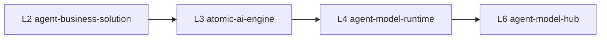
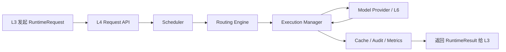
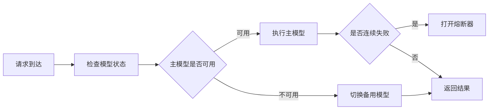

# agent-model-runtime 方案

本文档定义 L4 `agent-model-runtime` 的技术方案，作为模型调度与执行层的正式设计文档，用于技术评审与后续开发落地。

## 1. 定位
- 项目名：`agent-model-runtime`
- 层级：L4
- 技术：Java
- 角色：模型调用治理层 / 运行时治理中心

一句话定义：
- `agent-model-runtime` 是大模型调用的运行时治理中心，不是模型本身，也不是业务场景层。

## 2. 设计目标
- 承接 L3 `atomic-ai-engine` 发起的模型执行请求。
- 统一做同步/异步、排队、并发、超时、重试、熔断、降级与缓存治理。
- 为 L1 控制台提供可聚合的运行态视图。
- 让 L3 不再分散承担模型执行治理逻辑。

运行目标：
- 稳时延
- 保吞吐
- 控成本
- 提可用

## 3. 职责边界
### 3.1 L4 负责
- 模型执行请求接入
- 请求排队与优先级调度
- 并发控制
- 超时与有限重试
- 熔断与降级
- 取消与回调
- 批处理
- 缓存复用
- 多模型路由执行
- 请求级审计、指标与任务状态查询

### 3.2 L4 不负责
- 业务场景编排：L2
- 原子能力实现：L3
- 模型资产管理与评测：L6
- 知识资产治理：L5
- 统一入口鉴权与运营入口：L1

## 4. 上下游关系


关系说明：
- L2 负责业务流程编排。
- L3 决定调用哪个原子能力。
- 当某个原子能力需要模型推理时，由 L3 请求 L4。
- L4 基于任务类型、成本、延迟、健康状态进行路由和执行治理。
- L6 提供模型池、版本、成本基线和路由输入。
- 当前实现中，L4 会优先读取 L6 `GET /routes/recommendations/{task_type}` 作为实际路由依据，L6 不可用时再回退本地默认路由。

## 5. 核心模块设计
### 5.1 Request API
接收模型运行请求。

建议接口：
- `POST /runtime/invoke`
- `POST /runtime/async-jobs`
- `GET /runtime/async-jobs/{job_id}`
- `POST /runtime/async-jobs/{job_id}/cancel`
- `POST /runtime/batch`

### 5.2 Scheduler
负责优先级和队列调度。

能力包括：
- 优先级队列
- 同步/异步任务分流
- 按租户/任务类型/能力类型调度
- 忙时排队和拒绝策略

### 5.3 Execution Manager
负责实际执行。

能力包括：
- worker 并发池
- timeout
- retry
- cancel
- callback
- fallback

### 5.4 Routing Engine
负责模型路由。

路由输入：
- `task_type`
- `capability_code`
- 成本上限
- 延迟目标
- 模型可用性
- 熔断状态
- 质量要求

路由输出：
- 主模型
- 备用模型
- 降级路径

### 5.5 Cache Layer
负责结果复用。

适用场景：
- 完全相同请求
- 文档处理重复片段
- 批量任务重复调用

### 5.6 Circuit Breaker / Degrade Manager
负责稳定性保护。

能力包括：
- 模型级熔断
- 上游限流
- fallback 模型
- 降级响应

### 5.7 Job Store / Audit Store
负责任务状态和执行审计。

记录内容：
- 请求状态
- 开始/结束时间
- 路由结果
- 重试次数
- 错误信息
- 回调状态
- 缓存命中情况

### 5.8 Ops API
面向 L1 控制台和调试台。

建议接口：
- `GET /ops/overview`
- `GET /ops/queues`
- `GET /ops/routes`
- `GET /ops/jobs`
- `GET /ops/circuits`

## 6. 关键接口契约
### 6.1 同步调用
`POST /runtime/invoke`

请求示例：
```json
{
  "request_id": "req-001",
  "capability_code": "structured_extraction",
  "task_type": "document_extraction",
  "priority": "normal",
  "timeout_ms": 8000,
  "input": {
    "text": "供应商响应文件存在授权链不完整与条款偏离风险。"
  },
  "routing_preferences": {
    "latency_first": false,
    "cost_ceiling": 0.2
  }
}
```

响应示例：
```json
{
  "request_id": "req-001",
  "status": "success",
  "model_route": "general-llm-v1",
  "attempts": 1,
  "cached": false,
  "duration_ms": 682,
  "result": {
    "fields": {
      "risk_level": "high"
    }
  },
  "errors": []
}
```

### 6.2 异步任务
- `POST /runtime/async-jobs`
- `GET /runtime/async-jobs/{job_id}`
- `POST /runtime/async-jobs/{job_id}/cancel`

### 6.3 批处理
- `POST /runtime/batch`

## 7. 核心数据模型
### RuntimeRequest
- `request_id`
- `capability_code`
- `task_type`
- `priority`
- `input`
- `timeout_ms`
- `callback_url`
- `routing_preferences`

### RuntimeResult
- `request_id`
- `status`
- `model_route`
- `attempts`
- `cached`
- `duration_ms`
- `result`
- `errors`

### RuntimeJob
- `job_id`
- `request_id`
- `queue_name`
- `priority`
- `status`
- `submitted_at`
- `started_at`
- `finished_at`

### CircuitState
- `model_code`
- `state`
- `failure_count`
- `open_until`

## 8. 关键流程
### 8.1 同步执行流程


### 8.2 熔断降级流程


## 9. 在采购文件场景中的作用
场景链路：
1. L2 发起采购文件审核流程。
2. L3 执行 `file_parse`。
3. L3 执行 `rule_engine`。
4. 若规则命中，L2 直接返回。
5. 若规则未命中，L3 执行 `structured_extraction`。
6. `structured_extraction` 请求 L4。
7. L4 根据 `task_type=document_extraction` 完成模型路由与治理。
8. L4 返回结果给 L3。
9. L3 返回给 L2。
10. L2 汇总为最终业务输出。

边界重点：
- L4 不知道“采购文件场景”。
- L4 只处理模型执行任务。

## 10. MVP 范围
### 10.1 第一阶段必须有
- `POST /runtime/invoke`
- 按 `task_type` 路由模型
- 超时控制
- 有限重试
- 简单并发控制
- 请求级执行日志
- `GET /ops/overview`
- `GET /ops/jobs`
- 模型级熔断与备用路由

### 10.2 第二阶段再做
- 异步任务
- 取消
- 回调
- 批处理
- 缓存复用
- 更复杂的调度策略
- 多队列隔离

## 11. 非功能要求
### 11.1 稳定性
- 支持超时、重试、熔断、降级。
- 模型故障不应拖垮上层能力链路。

### 11.2 性能
- 控制同步调用尾延迟。
- 支持并发治理。
- 支持热点结果缓存。

### 11.3 可观测性
- 每个任务记录：
  - `request_id`
  - `task_type`
  - `model_route`
  - `status`
  - `duration_ms`
  - `attempts`
  - `cached`

### 11.4 审计性
- 每个执行请求可追踪。
- 可被 L1 控制台聚合展示。

## 12. 目录结构建议
```text
agent-model-runtime/
├── src/
│   ├── Main.java
│   ├── api/
│   │   ├── RuntimeHandler.java
│   │   └── OpsHandler.java
│   ├── scheduler/
│   │   ├── Scheduler.java
│   │   └── PriorityQueueManager.java
│   ├── execution/
│   │   ├── ExecutionManager.java
│   │   ├── RetryPolicy.java
│   │   └── TimeoutController.java
│   ├── routing/
│   │   ├── RoutingEngine.java
│   │   └── RoutePolicy.java
│   ├── circuit/
│   │   ├── CircuitBreaker.java
│   │   └── DegradePolicy.java
│   ├── cache/
│   │   └── ResultCache.java
│   ├── store/
│   │   ├── JobStore.java
│   │   └── AuditStore.java
│   ├── model/
│   │   ├── RuntimeRequest.java
│   │   ├── RuntimeResult.java
│   │   └── RuntimeJob.java
│   └── provider/
│       └── ModelProviderClient.java
├── config/
│   ├── runtime.properties
│   └── routes.properties
├── scripts/
│   ├── build.sh
│   ├── test.sh
│   ├── run.sh
│   └── healthcheck.sh
└── README.md
```

## 13. 当前实现与目标差距分析
基于 `/Users/linzeran/code/2026-zn/harnees_aimp/agent-model-runtime/src/Main.java` 的当前实现，L4 现状更接近“最小运行桩”，还没有达到运行时治理层的目标。

### 13.1 当前已具备
- `GET /health`
- `POST /invoke`
- 最小 `GET /ops/runtime` 运行摘要
- 基于 `task_type` 的最小响应回显
- Java 单体进程骨架
- 基础 `scripts/build.sh`、`scripts/run.sh`、`scripts/test.sh`

### 13.2 当前明显缺失
- 没有真正的调度器和队列
- 没有并发控制与 worker 池
- 没有超时与重试执行逻辑
- 没有熔断器状态机
- 没有降级路由
- 没有异步任务模型
- 没有取消与回调
- 没有批处理
- 没有结果缓存
- 没有任务持久化与审计存储
- 没有和 L6 的真实模型路由协作
- 运营接口还不足以支撑 L1 全量聚合

### 13.3 当前实现的主要风险
- 运行元数据是固定返回，不能反映真实执行状态。
- `POST /invoke` 只做回显，不具备真正治理能力。
- 所有运行态都在单文件里，后续扩展会快速失控。
- 缺少作业模型后，异步、重试、取消、回放都没有稳定落点。

### 13.4 建议的落地顺序
1. 先补 `RuntimeRequest`、`RuntimeResult`、`RuntimeJob` 三个核心模型。
2. 再补 `RoutingEngine`、`ExecutionManager`、`RetryPolicy`。
3. 接着补 `JobStore` 和 `GET /ops/jobs`。
4. 再补熔断与备用模型路由。
5. 最后扩展异步任务、取消、回调和缓存。

### 13.5 当前评审结论
- L4 的方向是对的，层级定位清晰。
- 当前实现仍处于“最小占位服务”阶段。
- 下一轮开发应优先把它升级为“可治理的同步运行时 MVP”，而不是继续堆功能名词。

## 14. 评审重点
技术评审时建议重点看：
1. L4 是否清晰地只承担模型治理职责。
2. L4 与 L3/L6 的边界是否稳定。
3. 同步、异步、批处理是否可统一到同一请求模型。
4. 熔断、重试、超时、降级是否是框架级能力。
5. 运营接口是否足够支撑 L1 聚合控制台。
6. Java 实现是否便于并发、队列和后续扩展。

## 15. 结论
建议定稿方向：
- L4 采用独立 Java 服务。
- 先做运行时治理 MVP。
- 由 L3 统一调用 L4。
- 由 L1 聚合 L4 运营视图。
- 后续再扩展异步、回调、批处理和缓存。
