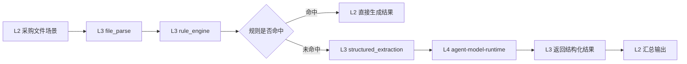

# atomic-ai-engine 方案

本文档定义 L3 `atomic-ai-engine` 的 SDK 架构方案。L3 不再按独立服务形态设计，而是作为统一发布的原子能力引擎 SDK，对 L2 提供可复用、可组合、可标准调用的能力集合。

## 1. 目标
- 以 SDK 形态向 L2 输出标准化、可复用、可组合的原子能力。
- 让 L2 专注业务场景编排，而不是自行实现底层能力。
- 把模型调用治理统一收口到 L4 `agent-model-runtime`。
- 为未来需要时再演进为服务化能力层保留清晰升级路径。

## 2. 定位
- 项目名：`atomic-ai-engine`
- 层级：L3
- 技术：Python SDK
- 角色：原子能力引擎层
- 交付方式：以 Python 包 / SDK 形式被 L2 引用

## 3. 核心判断
### 3.1 为什么采用 SDK 形态
- 当前阶段更关注场景研发效率与能力复用效率。
- 如果将每个原子能力都做成独立服务，会导致服务数量过多、治理成本过高。
- 如果让 L2 直接散乱引用各类工具函数，又会导致 L2/L3 边界塌陷。
- 因此 L3 采用“统一 SDK + 内部能力模块化”的形态最合适。

### 3.2 L3 与 L2/L4 的关系
- L2：负责业务场景编排。
- L3：负责原子能力供给。
- L4：负责模型执行治理。
- 当 L3 中某个能力需要模型能力时，L3 通过标准 client 调用 L4，而不是自行绕开 L4 直接调用模型。
- 当 L3 需要模型推理时，应由具体能力先构造业务级 prompt 或 messages，再交由 L4 执行；不要把平台内部 runtime 封装直接暴露给模型。

## 4. 职责边界
### 4.1 L3 负责
- 原子能力注册与发现
- 原子能力统一调用入口
- 标准输入输出结构
- 原子能力组合与复用
- 必要时向 L4 发起模型调用
- 能力级错误码、执行元数据与结果封装

### 4.2 L3 不负责
- 业务场景编排
- 面向最终业务用户的场景服务输出
- 模型队列、并发、重试、熔断、成本治理
- 知识资产全生命周期治理
- 平台与基础设施治理

## 5. 原子能力清单
L3 里按“一个能力一个单元”建模。当前目标能力包括：
- `intent_understanding`：意图理解
- `problem_decomposition`：问题拆解
- `multi_recall`：多路召回
- `hybrid_retrieval`：混合检索
- `fusion_rerank`：融合重排序
- `relevance_filter`：相关性过滤
- `knowledge_aggregation`：知识聚合/补全
- `context_management`：上下文管理
- `file_parse`：文件解析
- `structured_extraction`：结构化提取
- `clause_extraction`：条款提取
- `technical_spec_extraction`：技参提取
- `rule_engine`：规则引擎
- `knowledge_graph_retrieval`：知识图谱检索
- `logic_tree_explanation`：逻辑树解释
- `evidence_chain_locate`：证据链定位

## 6. 对外使用方式
L2 不直接 import 各个能力文件，而是通过 L3 的统一 SDK 入口使用能力。例如：

```python
from atomic_ai_engine import CapabilityEngine

engine = CapabilityEngine.from_config()
result = engine.invoke(
    capability_code="file_parse",
    payload={"file_uri": "/tmp/bid.pdf"}
)
```

统一原则：
- L2 只依赖 L3 的公开 SDK 接口
- L2 不依赖 L3 内部模块路径
- L2 不在自身代码里重写 L3 已有能力逻辑

## 7. 推荐目录结构
```text
atomic-ai-engine/
├── atomic_ai_engine/
│   ├── __init__.py
│   ├── engine.py
│   ├── registry.py
│   ├── errors.py
│   ├── models.py
│   ├── l4_client.py
│   └── capabilities/
│       ├── intent_understanding/
│       │   ├── manifest.json
│       │   └── service.py
│       ├── problem_decomposition/
│       │   ├── manifest.json
│       │   └── service.py
│       ├── multi_recall/
│       │   ├── manifest.json
│       │   └── service.py
│       ├── hybrid_retrieval/
│       │   ├── manifest.json
│       │   └── service.py
│       ├── fusion_rerank/
│       │   ├── manifest.json
│       │   └── service.py
│       ├── relevance_filter/
│       │   ├── manifest.json
│       │   └── service.py
│       ├── knowledge_aggregation/
│       │   ├── manifest.json
│       │   └── service.py
│       ├── context_management/
│       │   ├── manifest.json
│       │   └── service.py
│       ├── file_parse/
│       │   ├── manifest.json
│       │   └── service.py
│       ├── structured_extraction/
│       │   ├── manifest.json
│       │   └── service.py
│       ├── clause_extraction/
│       │   ├── manifest.json
│       │   └── service.py
│       ├── technical_spec_extraction/
│       │   ├── manifest.json
│       │   └── service.py
│       ├── rule_engine/
│       │   ├── manifest.json
│       │   └── service.py
│       ├── knowledge_graph_retrieval/
│       │   ├── manifest.json
│       │   └── service.py
│       ├── logic_tree_explanation/
│       │   ├── manifest.json
│       │   └── service.py
│       └── evidence_chain_locate/
│           ├── manifest.json
│           └── service.py
├── tests/
│   ├── test_registry.py
│   ├── test_engine.py
│   └── test_capabilities.py
└── README.md
```

## 8. 核心对象模型
### 8.1 CapabilityManifest
- `capability_code`
- `name`
- `version`
- `status`
- `entrypoint`
- `input_schema`
- `output_schema`
- `depends_on_model_runtime`

### 8.2 CapabilityRequest
- `request_id`
- `capability_code`
- `payload`
- `context`
- `options`

### 8.3 CapabilityResponse
- `request_id`
- `capability_code`
- `status`
- `result`
- `evidence`
- `errors`
- `metrics`

## 9. 统一 SDK 接口
### 9.1 能力引擎初始化
```python
engine = CapabilityEngine.from_config()
```

### 9.2 能力调用
```python
engine.invoke(capability_code="structured_extraction", payload={"document": "..."})
```

### 9.3 能力目录查询
```python
engine.list_capabilities()
engine.get_capability("file_parse")
```

## 10. 采购文件场景中的 L2-L3-L4 关系
以“采购文件解析 -> 规则命中 -> 未命中才调用模型”为例：



这里的职责分工是：
- L2：决定先做文件解析、再做规则判断、最后是否进入模型兜底。
- L3：提供文件解析、规则引擎、结构化提取等原子能力。
- L4：只负责模型执行治理。

## 11. 设计原则
- 一个能力一个单元
- 一个 SDK 对外发布，不拆成多个微服务
- L2 通过统一引擎接口使用 L3
- 凡是模型执行都统一走 L4
- 能力结果必须标准化、可组合
- 能力内部实现可以复用本地库，但不向 L2 暴露内部细节

## 12. 与服务化方案的关系
当前采用 SDK 形态，不代表未来不能服务化。
未来如果出现以下条件，可考虑把 L3 演进为服务：
- 多个项目需要跨进程、跨语言复用 L3
- 能力需要独立扩缩容
- 能力调用需要更强的审计、限流、权限治理
- L3 的使用方不再主要是 L2，而是多个独立系统

也就是说：
- 当前阶段：`atomic-ai-engine` 以 SDK 形态交付
- 后续阶段：在必要时演进为服务化能力层

## 13. 第一阶段建议落地能力
建议优先落以下 5 个能力，先把采购文件类场景跑通：
- `file_parse`
- `rule_engine`
- `structured_extraction`
- `intent_understanding`
- `evidence_chain_locate`

## 14. 第一阶段验收标准
- L2 可通过 SDK 直接调用 L3 统一引擎
- L3 至少注册 5 个原子能力
- `file_parse -> rule_engine -> structured_extraction -> L4` 的兜底链路可跑通
- L3 内部能力模块与 L2 场景代码分离
- L3 能对每次能力调用返回统一结构


## 15. 能力级运营视图
当前 `atomic-ai-engine` 已规划并落地最小能力级运营视图，用于被 L1 控制台聚合。

### 15.1 运营接口
- `GET /ops/overview`
- `GET /ops/capabilities`
- `GET /ops/capabilities/{capability_code}`

### 15.2 当前输出内容
- 总调用量
- 成功/失败调用量
- 平均耗时
- 按能力聚合的调用统计
- 错误码统计
- 最近调用记录

### 15.3 价值
- 让 L3 从“能调用”进入“可运营”
- 为 L1 控制台提供能力级调用量、错误码和耗时数据源
- 为后续能力限流、审计和成本视图打基础
